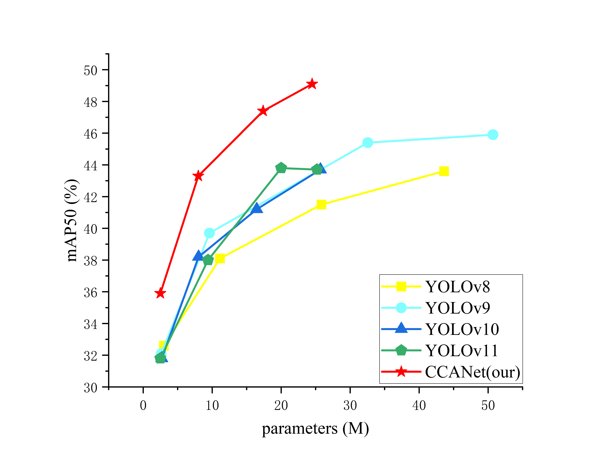
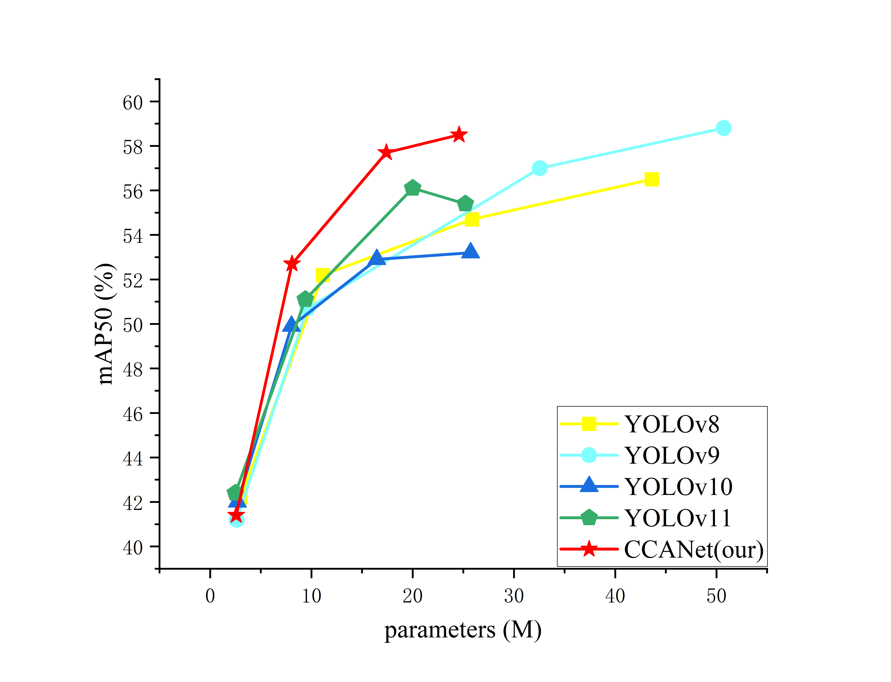

# [CCANet: A Cross-scale Context Aggregation Network for UAV Object Detection](https://arxiv.org/abs/2405.14458)


Official PyTorch implementation of **CCANet**.

<p align="center">
  
   <br>
  Complexity-accuracy is compared with other methods on the VisDrone dataset (left) and the NightDrone dataset (right).
</p>

## Installation
`conda` virtual environment is recommended. 
```
conda create -n CCANet python=3.9
conda activate CCANet
pip install -r requirements.txt
pip install -e .
```
## Demo
```
python app.py
# Please visit http://127.0.0.1:7860
```

## Validation
```
yolo val model=yolov8n.pt data=VisDrone.yaml batch=8

```


## Training 
```
yolo detect train data=coco.yaml model=yolov10n/s/m/b/l/x.yaml epochs=500 batch=256 imgsz=640 device=0,1,2,3,4,5,6,7
yolo detect train data=VisDrone.yaml model=CCANet.yaml epochs=200 batch=8 imgsz=640
```

## Acknowledgement

The code base is built with [ultralytics](https://github.com/ultralytics/ultralytics) and [YOLOv10](https://github.com/THU-MIG/yolov10).

Thanks for the great implementations! 

## Citation

If our code or models help your work, please cite our paper

